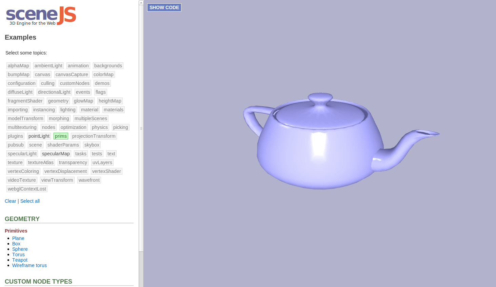
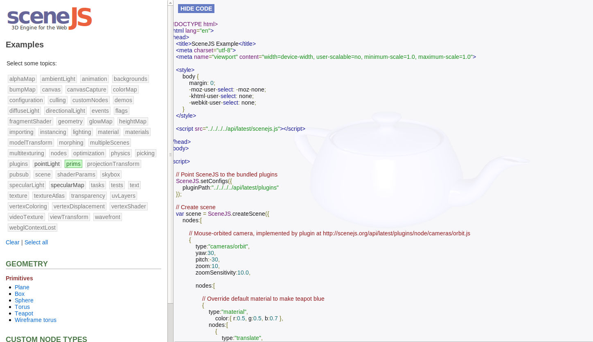

#### Organise and share your API example pages with this tag-searchable example browser

[](http://scenejs.org/examples.html?page=teapotNodePrim) | [](http://scenejs.org/examples.html?page=teapotNodePrim&showCode=true)
----|----
Execution view - [try it](http://scenejs.org/examples.html?page=teapotNodePrim)  | Code view - [try it](http://scenejs.org/examples.html?page=teapotNodePrim&showCode=true)

### 1. Get your example pages together
Start with a bunch of HTML example pages that demo the various features of your API, like [these examples for SceneJS 3.1](https://github.com/xeolabs/scenejs/tree/V3.1/examples/ex). 

Note that we don't have to modify those any any way. ExampleJS is non-invasive and is to use in addition to your existing examples pages, as an index.

### 2. Make an index file
Make a [JSON index](https://github.com/xeolabs/examplejs/wiki/ExampleJS-Index-File) that references those pages and gives them display names and searchable tags,
 [like this one](https://github.com/xeolabs/scenejs/blob/V3.1/examples/ex/index.json). 

### 3. Make your catalogue page
Make an HTML page which contains an instance of ExampleJS, linking to ExampleJS library and the JSON index, like
[this one for SceneJS](https://github.com/xeolabs/scenejs/blob/V3.1/examples.html) - use that as a template for your own catalogue page.

### 4. Load that catalogue page
Le voilà! Examples nicely laid out and indexed with searchable tags.

ExampleJS supports some URL params for sharing examples:
* ```tags``` - the index file assigns tags to your examples, and you can select those on the URL: 
[http://scenejs.org/examples.html?tags=physics,optimization](http://scenejs.org/examples.html?tags=physics,optimization)
* ```page``` - the index file lets you assign optional IDs to your examples, which can be given on the URL to directly open them:
[http://scenejs.org/examples.html?page=physicsBouncingSpheres](http://scenejs.org/examples.html?page=physicsBouncingSpheres).
* ```showCode=true``` - put this param on the URL to open the code view:
[http://scenejs.org/examples.html?page=physicsBouncingSpheres&showCode=true](http://scenejs.org/examples.html?page=physicsBouncingSpheres&showCode=true).


### How does it work?
The ExampleJS library is served off github pages, which is fairly reliable. In the catalogue page, we load the lib and make an instance of it configured to load our example pages using those absolute URLs you see in the JSON index.

The examples browser is re-badgeable with different logo - see example in (3) for the configs.

License is GPL and MIT.

I hope this enhances productivity for your project!

